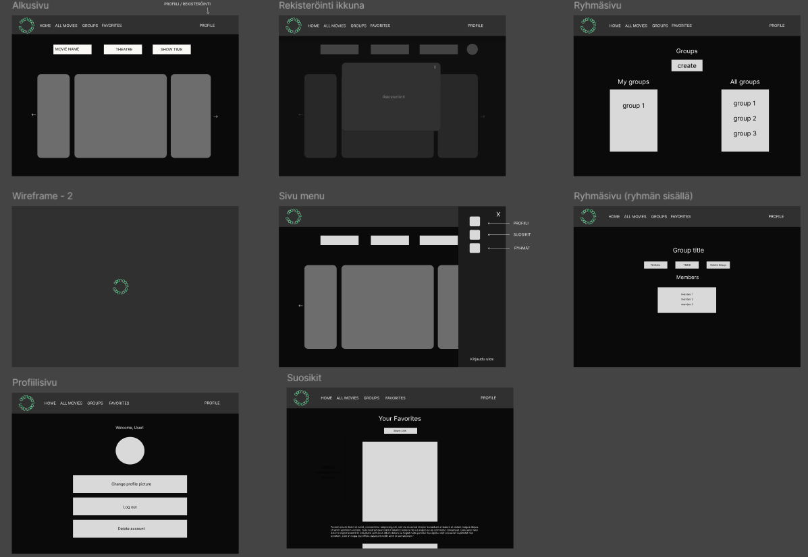
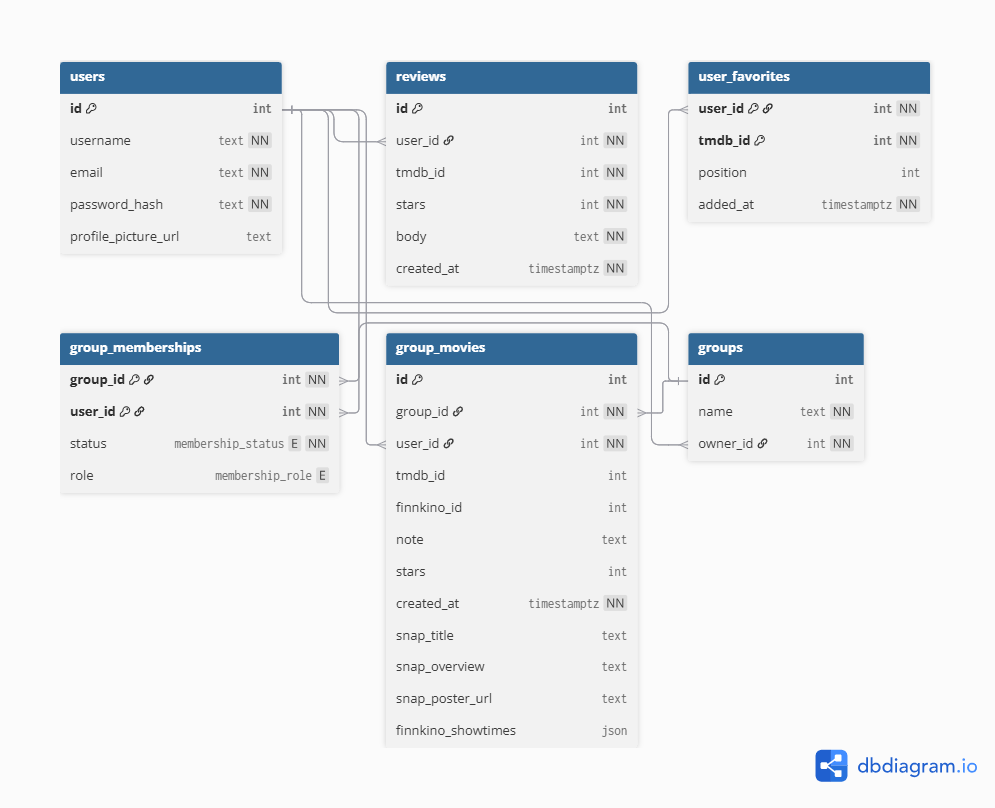

# Web-Application-Project Group 10

A movie web application built with React, Express, and PostgreSQL. Users can sign up, log in, review movies, manage favorites, join groups, and upload profile pictures.

[MadMooseMovies](https://websovellus-projekti-ryhma-10-front.onrender.com/) <-- Find our web application here!

## Features

- **User Authentication:** Sign up, sign in, and delete account.
- **Profile Management:** Upload and display profile pictures.
- **Movie Reviews:** Add reviews with star ratings and comments.
- **Movie Search:** Search movies from tmdb with name, genre and release year. Search movies from finnkino with name, theatre and showtime.
- **Favorites:** Mark movies as favorites and share favorites.
- **Groups:** Create and join groups, manage group memberships.
- **Group Movies:** Add movies to groups with notes and ratings.

## Extra Features
- **Animation:** Various animations on our page on headers etc.
- **Finnkino search with 3 criterias:** Finnkino search with title, theatre and showtime.
- **Profile picture:** Users can add profile pictures to profile page.
- **Movie Carousels:** Popular & Now in theatres carousels for each search to highlight trending movies.

## Technologies

- **Frontend:** React (Vite)
- **Backend:** Express (Node.js)
- **Database:** PostgreSQL
- **Testing:** Mocha, Supertest, Postman

## Project Structure

```
web/
  ├── server/         # Express backend
  │   ├── models/     # Database models
  │   ├── routes/     # API routes
  │   ├── controllers/# Route controllers
  │   ├── moviedb.sql # Database schema
  │   └── index.js    # Server entry point
  └── src/            # React frontend
      ├── screens/    # Page components (Profile, etc.)
      ├── assets/
      └── components/
```

## Wireframe



## Database Schema Overview

- **users:** Stores user info and profile picture URL.
- **reviews:** User reviews for movies.
- **user_favorites:** Favorite movies per user.
- **groups:** Movie groups.
- **group_memberships:** Group membership and roles.
- **group_movies:** Movies added to groups.


---

## Tests
Tests were done with Postman
[Tests here](https://documenter.getpostman.com/view/48990018/2sB3QJQBnL)

**Group 10**  
Jesse Hirvonen, Merja Sotkasiira, Salla-Mari Rokkonen, Tommy Näsänen, Anna Seppänen

Oulu University of Applied Sciences  
2025
